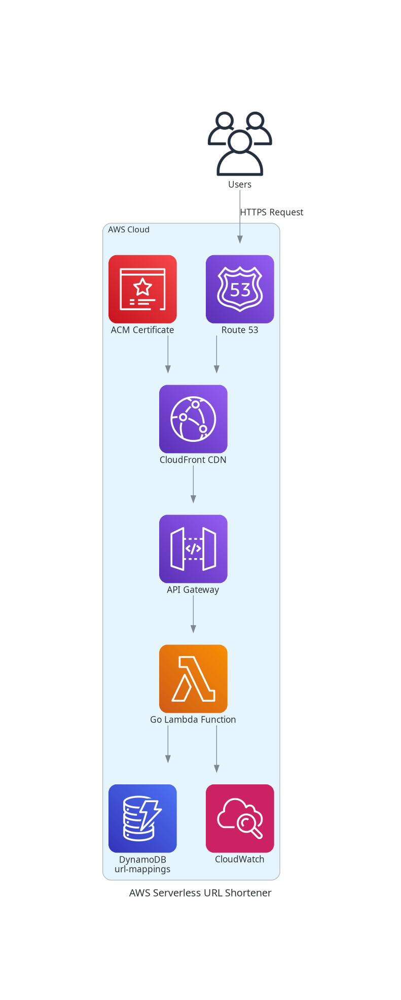

# Serverless URL Shortener - AWS CDK & Go

A production-ready serverless URL shortener built with **AWS CDK (TypeScript)** and **Go Lambda functions**, showcasing modern cloud architecture patterns and best practices.




## Project Overview

This project demonstrates a **fully serverless URL shortening service** built with:
- **Infrastructure as Code**: AWS CDK (TypeScript) for reproducible deployments
- **Backend**: Go Lambda functions for high-performance URL processing
- **Frontend**: Vanilla HTML/CSS/JS for simplicity and speed
- **Storage**: DynamoDB for scalable URL mapping
- **CDN**: CloudFront for global content delivery
- **Monitoring**: Enhanced CloudWatch dashboards and alerts

### [Live Demo](https://url-shortener.vibtellect.de)

## Architecture Highlights

- **100% Serverless**: No servers to manage, automatic scaling
- **Global CDN**: Sub-100ms response times worldwide
- **Cost-Optimized**: Pay-per-use pricing model
- **High Availability**: Multi-AZ deployment with automatic failover
- **Security**: HTTPS-only, IAM least-privilege access

## Quick Start

### Prerequisites

- [Node.js 18+](https://nodejs.org/)
- [AWS CLI](https://aws.amazon.com/cli/) configured with credentials
- [Go 1.21+](https://golang.org/)
- [AWS CDK](https://docs.aws.amazon.com/cdk/latest/guide/getting_started.html)

### 1. Install Dependencies

```bash
# Install CDK dependencies
cd cdk
npm install

# Install Go dependencies (for Lambda functions)
cd cdk/go
go mod tidy
```

### 2. Deploy Infrastructure

```bash
# From project root
cd cdk

# Bootstrap CDK (first time only)
cdk bootstrap

# Deploy the stack
cdk deploy --all
```

### 3. Access Your URL Shortener

After deployment, CDK will output:
- **Frontend URL**: Access your URL shortener web interface
- **API Endpoint**: Direct API access for programmatic usage

##  Project Structure

```
├── cdk/                   # AWS CDK infrastructure
│   ├── lib/               # CDK constructs and stacks
│   └── bin/cdk.ts         # CDK entry point
├── frontend/              # Static web frontend
├── go/                    # Go Lambda functions
├── docs/                  # Documentation & guides
└── README.md
```

## Development

### Local Development

```bash
# Start frontend locally
cd frontend
python -m http.server 8000

# Test Lambda functions locally
cd cdk/go
go test ./...
```

### Adding Custom Domains

1. Configure Route53 hosted zone
2. Update `cdk/lib/stateless.ts` with your domain
3. Redeploy: `cdk deploy`

### Monitoring & Debugging

- **CloudWatch Dashboard**: Automatic deployment with key metrics
- **X-Ray Tracing**: Distributed tracing for performance analysis
- **Custom Alarms**: Error rate and latency monitoring

## Cost Optimization

This project implements several cost optimization strategies:
- **Lambda Graviton2**: 20% better price-performance
- **DynamoDB On-Demand**: Pay-per-request pricing
- **CloudFront Caching**: Reduce origin requests by 90%
- **Resource Sharing**: Shared API Gateway across stages

See [Cost Optimization Guide](docs/COST_OPTIMIZATION.md) for detailed breakdown.

## Documentation

- [Deployment Guide](docs/DEPLOYMENT_GUIDE.md) - Step-by-step deployment instructions
- [Architecture Deep Dive](docs/architecture/) - Detailed architecture documentation
- [Blog Posts](docs/blog_posts/) - Technical articles about the implementation

## 🔧 Customization

### Environment Configuration

```bash
# Set custom domain
export DOMAIN_NAME=your-domain.com

# Configure environment
export ENVIRONMENT=production
```

### Adding Features

1. **Custom Analytics**: Add DynamoDB streams for click tracking
2. **URL Expiration**: Implement TTL for temporary URLs
3. **User Management**: Add Cognito for user authentication
4. **Rate Limiting**: Implement API Gateway usage plans

## Testing

```bash
# Run all tests
cd cdk
npm test

# Test Lambda functions
cd cdk/go
go test -v ./...
```

## Deployment Pipeline

Set up CI/CD with GitHub Actions:

```yaml
# .github/workflows/deploy.yml
name: Deploy URL Shortener
on:
  push:
    branches: [main]
```

## Contributing

1. Fork the repository
2. Create a feature branch
3. Make your changes
4. Add tests
5. Submit a pull request

## License

MIT License

---

**Built with AWS CDK, Go, and serverless architecture patterns**